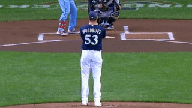

# pitchTip
 A proof of concept project using machine learning to detect if a pitcher is tipping his pitch

## Process
After taking many short videos of Brandon Woodruff's wind-up the following steps are taken.

* Videos are split into training and test sets
* Each video is paired with a 1 or 0 value to denote fastball or offspeed pitch
* Training videos are processed frame by frame using *Fast Feature Detection* which finds relevant recordable features
* Descriptors are computed from the data which are returned as a matrix of vectors where each vector is a descriptor (So one matrix per frame)
* That data is fed into a neural network along with the correct labels for the data
* Model is tested

## Limitations

### Problem Generalization

The program is only only setup to analyze one specific pitcher doing one specific motion.  Therefore, it can only analyze a single pitcher in the stretch or in the wind-up but not both.  Results after training a model with one pitcher and then testing with a different leads to results that are at best unreliable even if the two pitchers exhibit similar motion.
     
### The Why

In many machine learning domains, the accuracy of the model can be easily measured.  The accuracy is then used to judge the model.  In the case of pitch tipping, not every pitcher tips their pitches.  This project is looking for very small variations in the pitching motion that may not be obvious to the human eye.  That leads to the question, if a model doesn't perform well, is it because the model is wrong or because the pitcher is really good at his job?  

## Example

Because of copyright concerns I cannot upload the folder of videos full of Brandon Woodruff pitching but here are two gifs showing an example of raw video and then the analyzed video.

Each red dot in the second gif is a feature that was detected in the processing stage

## Results

Still in testing phase.  Want to test a few other random pitchers as well as one who was known to be tipping pitches last year.
